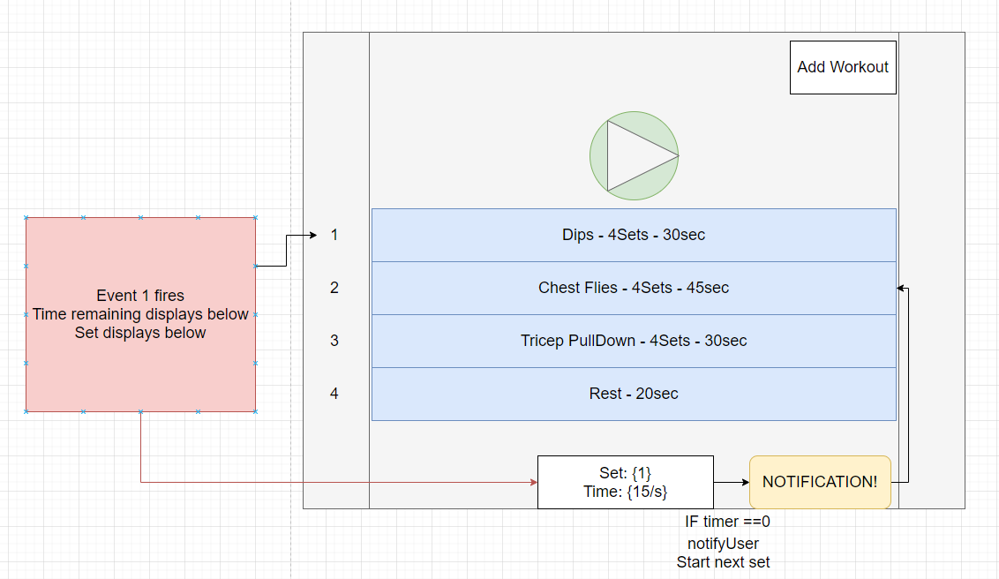

# HIITAppFinal

- This is a Xamarin.Forms android application that will help users with their HIIT fitness timer!
- Users can save multiple workout routines
- Workout routines will have a list of workouts within them
- Workouts have names, descriptions, and most importantly TIME. All of which are set by the user

